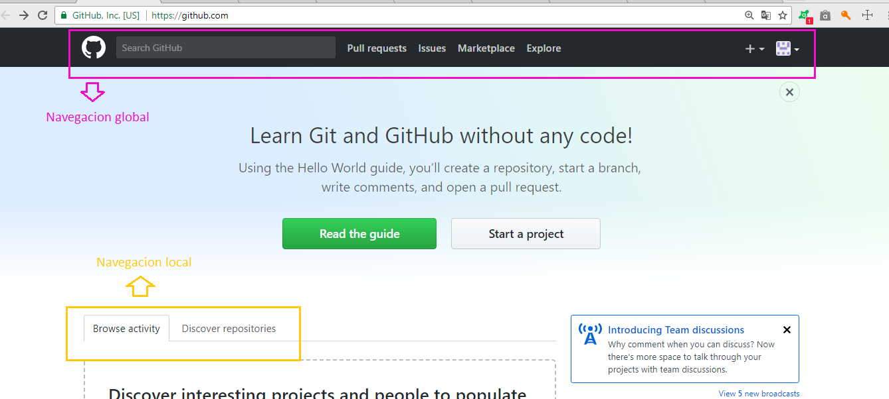
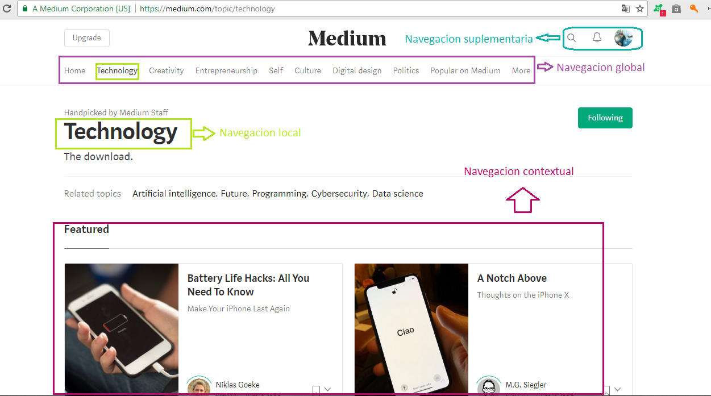

## Elementos de navegacion de una Web

En esta ocasión se dará a conocer los elementos de navegación en 
una web, en las siguientes imagenes.

### Breather

En la imagen, borde azul es de navegacion global porque aunque no aparece en todas  pero persiste en otras navegaciones y no siempre las navegaciones globales estaran persistente en todas. 

### GitHub

### Medium

